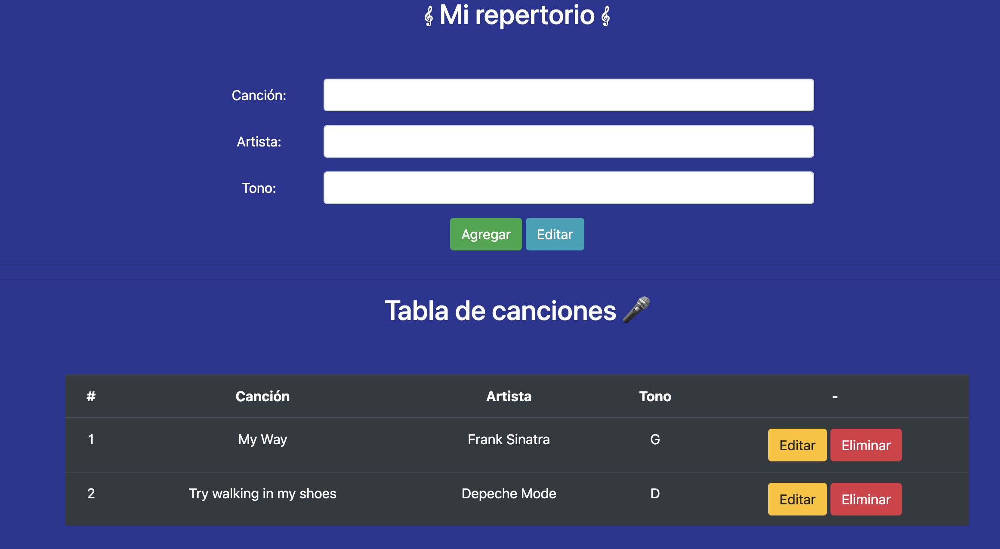

# Desafío Mi Repertorio

## Descripción

Esta aplicación permite listar, editar y eliminar items desde un listado de canciones.
Es un desafío de la carrera de Desarrollo Web Full Stack.

### Características

Se desarrolla un servidor con node y express utilizando las rutas necesarias para un CRUD.
El servidor corre en el puerto localhost:3000.



### Instalación

```
$ npm install
```

### Dependencias

- node v18.16.0
- express ^4.18.2
- nodemon ^2.0.22
- cors ^2.8.5
- dotenv ^16.0.3

### Iniciar el servidor

```
$npm start
```

### Endpoints

- GET /canciones
- POST /canciones
- PUT /canciones/:id
- DELETE /canciones/:id
